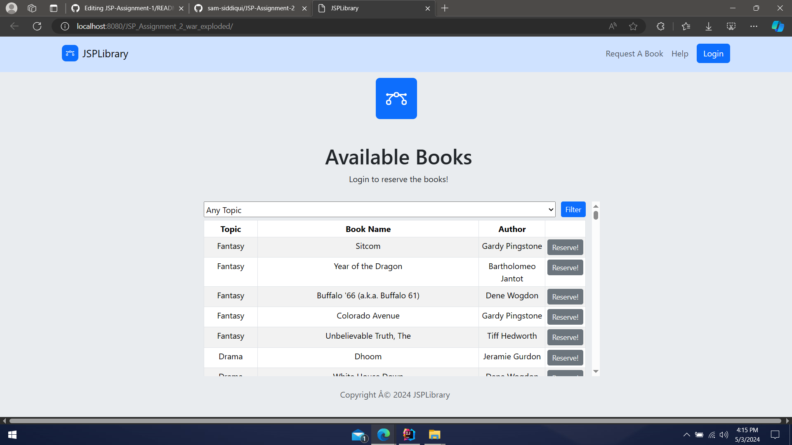
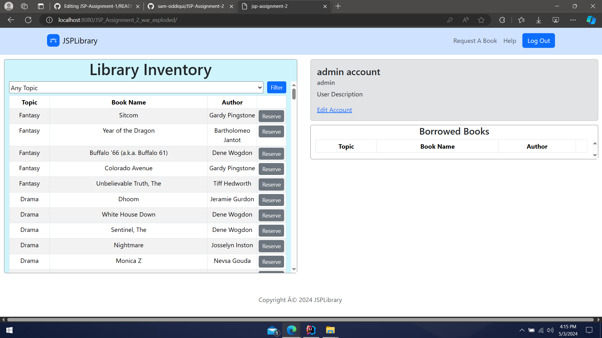
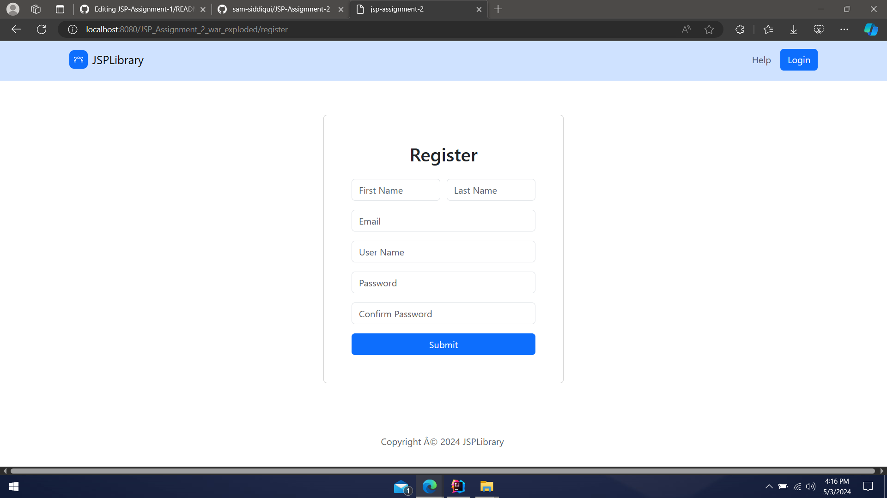

# JSP Assignment 2

## COMP - 6000

- src folder contains the source code

- `com.samsidd.jspassignment2` contains the controllers, Data Access Objects and Models and a Utils file

- `webapp` folder contains the `account.jsp`, `login.jsp`, `register.jsp`, `main.jsp` and the relevant css and js files
 
### Index Page

### Account Page

### Register Page

